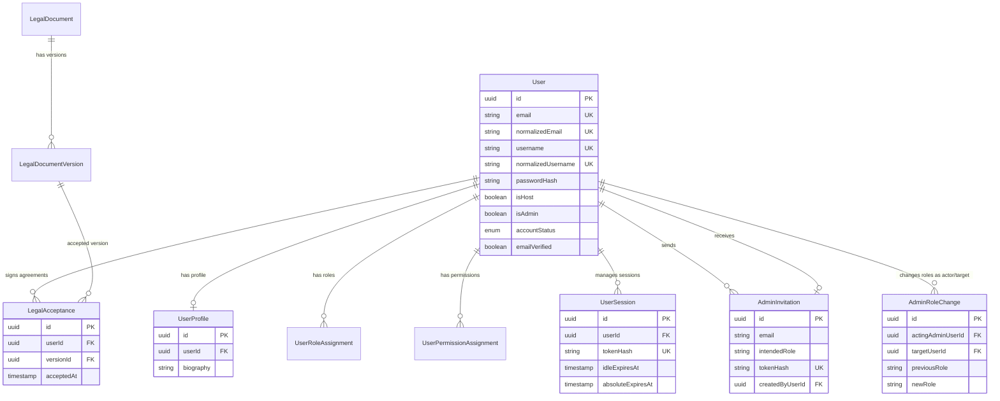
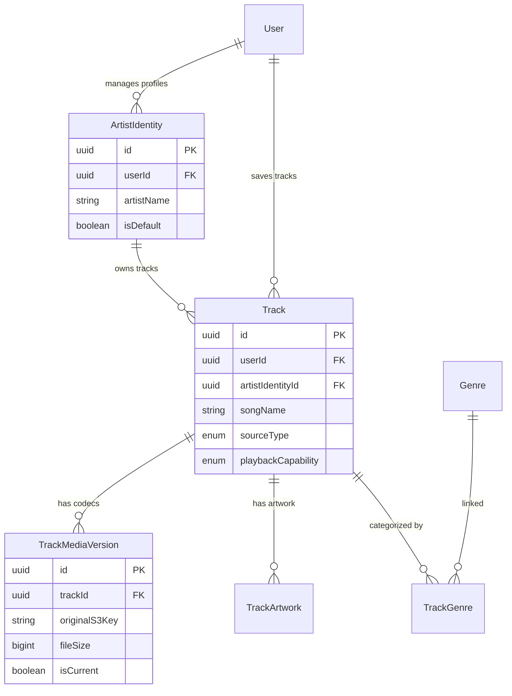
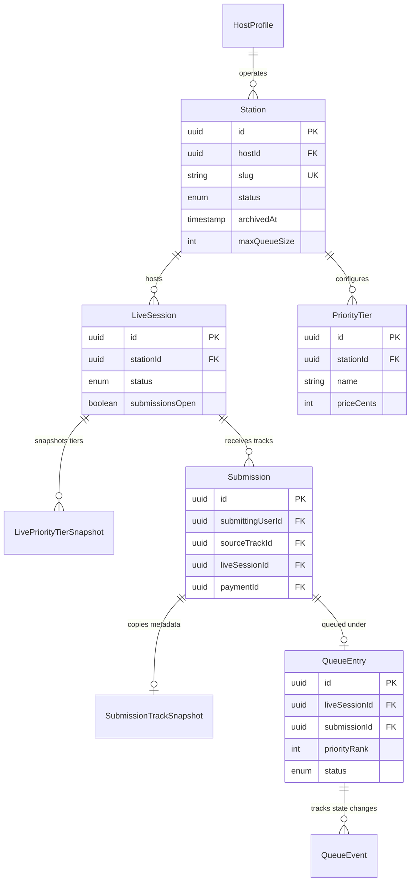
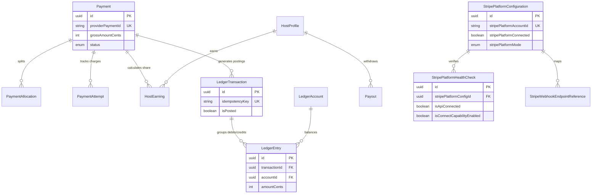

# Entity-Relationship Diagrams - TheQueue

Below are the Mermaid diagrams detailing entity relationships across **TheQueue** (thequeue.live) domain structure.

---

## 1. Identity, Security, & Legal Context

---

## 2. Music Library & Artist Profiles

---

## 3. Stations, Live Sessions, & Submission Queue

---

## 4. Stripe Payments, Ledger, and Payout Configurations

